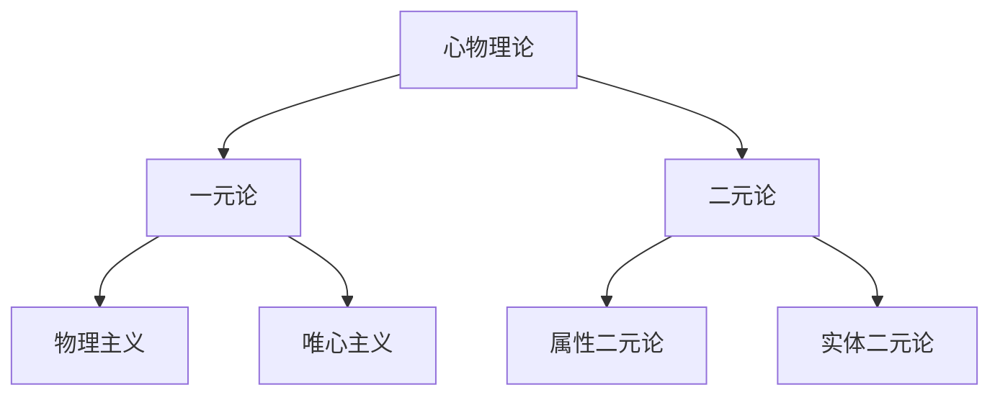

### Physicalism, Idealism, and Property Dualism (物理主义、唯心主义与属性二元论)

#### 本体论承诺图谱

```math
\begin{aligned}
\text{物理主义} &\models \forall P(\text{Property}(P) \to \text{Physical}(P)) \\
\text{属性二元论} &\models \exists P\exists Q(\text{Mental}(P) \land \text{Physical}(Q) \land P \neq Q) \\
\text{唯心主义} &\models \forall P(\text{Property}(P) \to \text{Mental}(P))
\end{aligned}
```

#### 理论谱系



#### 核心命题比较

| 理论       | 本体论基础             | 随附性关系             | 解释策略                 |
| ---------- | ---------------------- | ---------------------- | ------------------------ |
| 物理主义   | 所有属性最终是物理的   | 心理属性随附于物理属性 | 还原解释（如神经还原论） |
| 属性二元论 | 存在不可还原的心理属性 | 非对称随附             | 新神秘主义               |
| 唯心主义   | 所有属性本质是精神的   | 物理现象随附于心智     | 观念论解释               |

#### 关键论证

**属性二元论的支持证据**：

1. 感受质论证：疼痛的体验属性无法还原为 C 纤维激活（Jackson, 1982）
2. 解释鸿沟：物理描述与主观体验存在解释空白（Levine, 1983）
3. 知识论证：物理知识不包含体验知识（Frank Jackson 的玛丽房间思想实验）

**物理主义回应策略**：

```markdown
-   类型同一论：心理状态类型=脑状态类型（Place, 1956）
-   功能主义：心理属性是计算状态（Putnam, 1967）
-   消除唯物主义：否认心理属性的实在性（Churchland, 1981）
```
