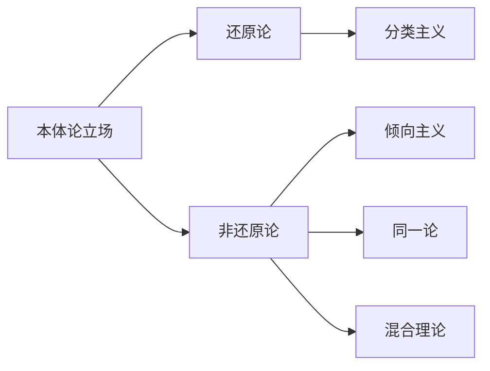

1. **强分类主义**
   主张所有倾向属性均可还原为微观结构分类属性：

    ```math
    \forall D\exists C(\text{Disposition}(D) \to \text{Categorical}(C) \land \text{Reduce}(D,C))
    ```

    > 如：玻璃的易碎性源于 SiO₂ 四面体网络结构

2. **倾向主义**
   认为属性本质即因果力：

    ```math
    \text{Property}(P) \equiv \exists S(\text{CausalPower}(S) \land P=S)
    ```

    > 如：电荷属性即产生电磁作用的因果力

3. **属性二元论**
   提出本体论双重结构：
    ```math
    \forall P\exists Q(\text{Categorical}(P) \land \text{Dispositional}(Q) \land \text{Supervene}(Q,P))
    ```
