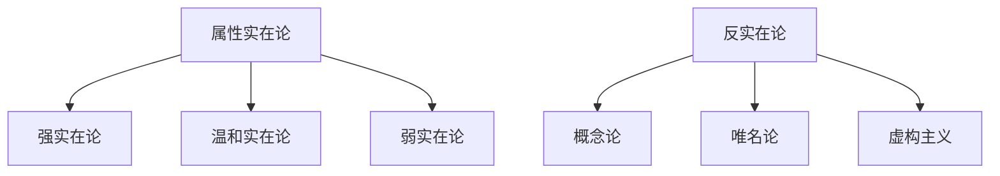
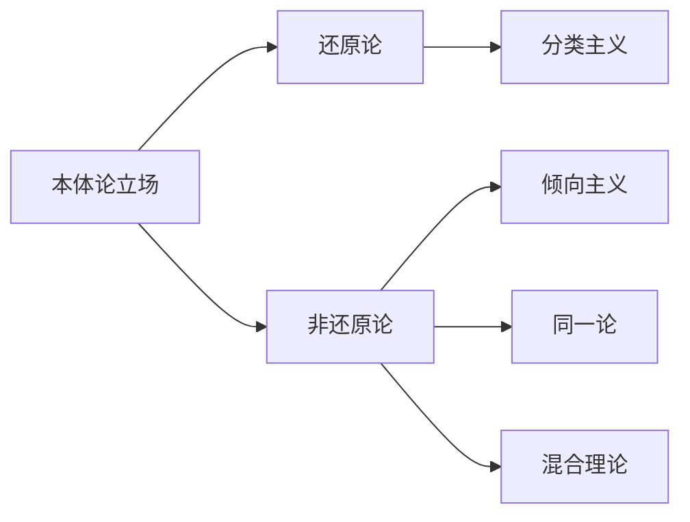
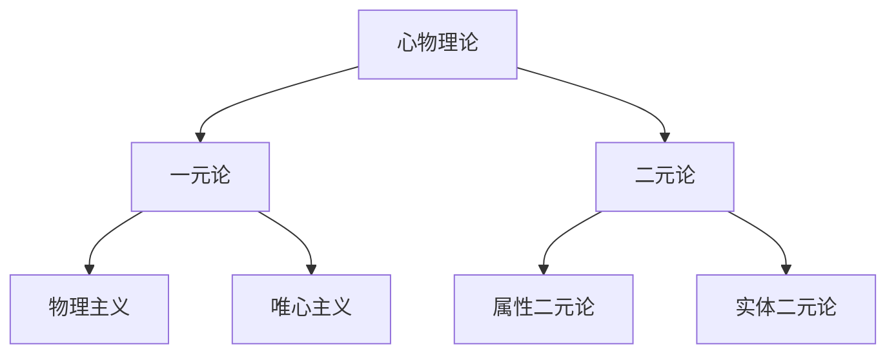

# Property (属性)

From Wikipedia, the free encyclopedia

In logic and philosophy (especially metaphysics), a property is a characteristic of an object; for example, a red object is said to have the property of redness. The property may be considered a form of object in its own right, able to possess other properties. A property, however, differs from individual objects in that it may be instantiated, and often in more than one object. It differs from the logical and mathematical concept of class by not having any concept of extensionality, and from the philosophical concept of class in that a property is considered to be distinct from the objects which possess it. Understanding how different individual entities (or particulars) can in some sense have some of the same properties is the basis of the problem of universals.
在逻辑和哲学（尤其是形而上学）中，属性是对象的特征。例如，红色对象被称为具有"红色性"(redness)属性。属性本身可被视为独立存在的抽象实体，能够拥有其他属性。属性不同于具体对象之处在于它可以被多重实例化，通常存在于多个对象中。它与逻辑和数学的类概念不同，因其不包含外延性概念；与哲学的类概念不同，属性被认为独立于拥有它的对象。理解不同个体实体（殊相）如何在某种意义上具有相同属性，构成了共相问题的核心。

## 等同 Attributes 属性

Objects in an ontology can be described by relating them to other things, typically aspects or parts. These related things are often called attributes, although they may be independent things. Each attribute can be a class or an individual. The kind of object and the kind of attribute determine the kind of relation between them. A relation between an object and an attribute express a fact that is specific to the object to which it is related. For example, the Ford Explorer object has attributes such as:
本体中的对象可以通过将它们与其他事物（通常是方面或部分）相关联来描述。这些相关事物通常称为属性，尽管它们可能是独立的事物。每个属性都可以是一个类或一个个体。对象的类型和属性的类型决定了它们之间的关系类型。对象与属性之间的关系表示特定于与其相关的对象的事实。例如，Ford Explorer 对象具有如下属性：

    ⟨has as name⟩ Ford Explorer
    ⟨有名⟩福特探险者
    ⟨as by definition as part⟩ 6-speed transmission
    ⟨根据定义作为部分⟩ 6 速变速器
    ⟨as by definition as part⟩ door (with as minimum and maximum cardinality: 4)
    ⟨根据定义作为 part⟩ 门（最小和最大基数为 4）
    ⟨as by definition as part one of⟩ {4.0L engine, 4.6L engine}
    ⟨根据定义作为第一部分⟩ {4.0L 发动机、4.6L 发动机}

The value of an attribute can be a complex data type; in this example, the related engine can only be one of a list of subtypes of engines, not just a single thing.
属性的值可以是复杂数据类型;在此示例中，related engine 只能是 engines 的子类型列表之一，而不仅仅是单个事物。

Ontologies are only true ontologies if concepts are related to other concepts (the concepts do have attributes). If that is not the case, then you would have either a taxonomy (if hyponym relationships exist between concepts) or a controlled vocabulary. These are useful, but are not considered true ontologies.
只有当概念与其他概念相关时（概念确实具有属性），本体才是真正的本体。如果不是这种情况，那么您将拥有分类法（如果概念之间存在下位词关系）或受控词汇表。这些是有用的，但不是真正的本体。

## Terms and usage 术语体系

### 核心概念

A property is any member of a class of entities that are capable of being attributed to objects. Terms similar to property include predicable, attribute, quality, feature, characteristic, type, exemplifiable, predicate, and intensional entity.[^1]
属性指可归属于对象的实体类成员。相近术语包括：可述谓的(predicable)、属性(attribute)、性质(quality)、特征(feature)、特性(characteristic)、类型(type)、可例示的(exemplifiable)、谓词(predicate)和内涵实体(intensional entity)[^1]。

### 谓述理论

Generally speaking, an object is said to exemplify, instantiate, bear, have or possess a property if the property can be truly predicated of the object. The collection of objects that possess a property is called the extension of the property.
当属性可被真实述谓于对象时，称该对象例示(exemplify)、实例化(instantiate)、承载(bear)、拥有(have)或具有(possess)该属性。拥有某属性的对象集合称为该属性的外延(extension)。

Followers of Alexius Meinong assert two modes of predication:
迈农主义者主张两种谓述模式：

1. **实存对象**通过例示属性存在
2. **非实存对象**通过编码(encode)被归因的属性存在

### 属性类型示例

| 属性类型 | 示例                      | 哲学争议          |
| -------- | ------------------------- | ----------------- |
| 存在性   | 非存在性属性[^4]          | 存在能否作为属性  |
| 同一性   | 同一于苏格拉底的属性[^1]  | 严格同一性问题    |
| 逻辑性   | 非自谓属性(heterological) | 格列林-纳尔逊悖论 |

Generally speaking, an object is said to exemplify, instantiate, bear, have or possess a property if the property can be truly predicated of the object. The collection of objects that possess a property is called the extension of the property. Properties are said to characterize or inhere in objects that possess them.[1] Followers of Alexius Meinong assert the existence of two kinds of predication: existent objects exemplify properties, while nonexistent objects are said to exemplify, satisfy, immanently contain or be consubstantiated by properties that are actually possessed and are said to encode, be determined by, be consociated with or be constituted by properties that are merely ascribed to objects. For example, since Pegasus is merely mythical, Pegasus encodes the property of being a horse, but Pegasus exemplifies the property of being a character of Greek mythology as well.[2] Edward Jonathan Lowe even treated instantiation, characterization and exemplification as three separate kinds of predication.[1]
一般来说，如果一个对象可以真正谓词，则称该对象为示例、实例化、承担、拥有或拥有一个属性。拥有属性的对象集合称为属性的扩展。据说属性是拥有它们的对象的特征或内在。[1] Alexius Meinong 的追随者断言存在两种谓词：存在的对象例证属性，而不存在的对象据说例证、满足、内在包含或被实际拥有的属性所证实，并据说编码、被决定、与仅归因于对象的属性相关联或被构成。例如，由于 Pegasus 只是神话，Pegasus 编码了作为马的特性，但 Pegasus 也体现了作为希腊神话人物的特性。[2] 爱德华·乔纳森·洛 （Edward Jonathan Lowe） 甚至将实例化、表征和示例化视为三种不同的谓词。[1]

Broadly construed, examples of properties include redness, the property of being two,[3] the property of being nonexistent,[4] the property of being identical to Socrates,[1] the property of being a desk,[1] the property of being a property,[1] the property of being both round and square,[1] and the property of being heterological. Some philosophers refuse to treat existence as a property, and Peter van Inwagen suggested that one should deny the existence of certain "properties" so as to avoid paradoxes such as Russell's paradox and Grelling–Nelson paradox, though such moves remain controversial.[1]
广义地解释，属性的例子包括红色，是二的属性，[3] 非存在性属性，[4] 同一于苏格拉底的属性，[1] 是桌子的属性，[1] 是属性的属性，[1] 是圆形和方形的属性，[1] 以及异质性的属性。一些哲学家拒绝将存在视为一种属性，Peter van Inwagen 建议人们应该否认某些“属性”的存在，以避免罗素悖论和格雷林-纳尔逊悖论等悖论，尽管这些举动仍然存在争议。[1]

## Metaphysical debates 形而上学论争

形而上学的辩论

In modern analytic philosophy there are several debates about the fundamental nature of properties. These center around questions such as: Are properties universals or particulars? Are properties real? Are they categorical or dispositional? Are properties physical or mental?
在现代分析哲学中，关于属性的基本性质存在一些争论。这些问题围绕着以下问题：属性是普遍的还是特殊的？属性是否真实存在？他们是分类的还是处置的？属性是物理的还是精神的？

### 共相 vs. 殊相 (Universals vs. particulars)

**柏拉图主义**主张属性是共相(universals)，可被不同对象实例化
**殊相论者**认为属性是殊质(tropes)，即个别的具体属性[^1]

At least since Plato, properties are viewed by numerous philosophers as universals, which are typically capable of being instantiated by different objects. Philosophers opposing this view regard properties as particulars, namely tropes.
至少从柏拉图开始，许多哲学家将属性视为普遍性，它们通常能够被不同的对象实例化。反对这种观点的哲学家将属性视为特殊性，即殊质/个别属性 (tropes) 。

### Realism vs. anti-realism(实在论 vs. 反实在论)



#### 实在论谱系

1. **超验实在论**（柏拉图主义）  
   主张属性作为共相独立于具体实例存在，即使未被例示依然存在。数学表达：

    ```math
    \exists P(\text{Property}(P) \land \Box\exists x(x=P))
    ```

    代表：柏拉图、弗雷格、早期罗素

2. **内在实在论**（亚里士多德传统）  
   主张属性存在当且仅当被实例化，数学表达：
    ```math
    \exists x(Property(x)) \leftrightarrow \exists y(Instance(y,x))
    ```
    现代发展：David Armstrong 的"事态"理论

#### 反实在论阵营

**语义学进路**：

-   **工具主义**：属性是解释现象的实用工具
-   **投射主义**：属性是人类认知的投射（Blackburn, 1984[^3]）
-   **虚构主义**：属性话语是启发式虚构（Yablo, 2001[^4]）

**本体论进路**：
| 流派 | 核心命题 | 代表人物 |
|------------|-----------------------------------|----------------|
| 唯名论 | 只有具体殊相存在 | William of Ockham |
| 概念论 | 属性是心智概念框架的产物 | Kant |
| 语用论 | 属性是语言游戏的约定 | Wittgenstein |

#### 认识论挑战

1. **不可观察属性困境**
   科学实在论认为电子电荷等理论实体具有真实属性，而建构经验论主张这些只是理论模型的实用构件

2. **数学属性本体论**
   实在论者主张数学属性独立存在：
    ```math
    \exists x(\text{PrimeNumber}(x) \land \neg \text{MentalConstruct}(x))
    ```
    反实在论者认为数学属性是心智构造：
    ```math
    \forall x(\text{Mathematical}(x) \to \text{Conceptual}(x))
    ```

[^3]: Blackburn, S. (1984). Spreading the Word. Oxford University Press.
[^4]: Yablo, S. (2001). Go Figure: A Path Through Fictionalism.

A realist about properties asserts that properties have genuine, mind-independent existence.[1] One way to spell this out is in terms of exact, repeatable, instantiations known as universals. The other realist position asserts that properties are particulars (tropes), which are unique instantiations in individual objects that merely resemble one another to various degrees. Transcendent realism, proposed by Plato and favored by Bertrand Russell, asserts that properties exist even if uninstantiated.[1] Immanent realism, defended by Aristotle and David Malet Armstrong, contends that properties exist only if instantiated.[1]

一个关于属性的现实主义者断言，属性具有真实的、独立于心智的存在。[1] 阐明这一点的一种方法是使用精确、可重复的实例化，称为普遍性。另一种现实主义立场断言，属性是细节（殊质/个别属性 (tropes) ），它们是单个对象中的唯一实例，只是在不同程度上彼此相似。由柏拉图提出并受到伯特兰·罗素 （Bertrand Russell） 青睐的超验现实主义断言，即使未实例化，属性也存在。[1] 亚里士多德和大卫·马莱特·阿姆斯特朗 （David Malet Armstrong） 捍卫的内在实在论认为，属性只有在实例化时才存在。[1]

The anti-realist position, often referred to as nominalism claims that properties are names we attach to particulars. The properties themselves have no existence.

反现实主义的立场，通常被称为唯名论，声称属性是我们附加到细节的名称。属性本身不存在。

### Categoricalism vs. Dispositionalism (分类主义 vs. 倾向主义)

#### 本体论差异

```math
\text{分类属性} \triangleq \lambda x.\phi(x) \quad \text{(描述性本质)}
\text{倾向属性} \triangleq \lambda x.\Diamond\psi(x) \quad \text{(潜在可能性)}
```

| 属性类型 | 认知维度 | 示例     | 科学基础       |
| -------- | -------- | -------- | -------------- |
| 分类属性 | 静态描述 | 晶体结构 | X 射线衍射分析 |
| 倾向属性 | 动态潜能 | 化学活性 | 分子轨道理论   |

#### 主要哲学立场



1. **强分类主义**
   主张所有倾向属性均可还原为微观结构分类属性：

    ```math
    \forall D\exists C(\text{Disposition}(D) \to \text{Categorical}(C) \land \text{Reduce}(D,C))
    ```

    > 如：玻璃的易碎性源于 SiO₂ 四面体网络结构

2. **倾向主义**
   认为属性本质即因果力：

    ```math
    \text{Property}(P) \equiv \exists S(\text{CausalPower}(S) \land P=S)
    ```

    > 如：电荷属性即产生电磁作用的因果力

3. **属性二元论**
   提出本体论双重结构：
    ```math
    \forall P\exists Q(\text{Categorical}(P) \land \text{Dispositional}(Q) \land \text{Supervene}(Q,P))
    ```

#### 当代论争焦点

**颜色本体论争议**：

```markdown
-   分类主义解释：颜色对应物体表面反射光谱（Byrne & Hilbert, 2003[^5]）
-   倾向主义解释：颜色是引发颜色经验的倾向（McGinn, 1996[^6]）
-   幻觉论证：倾向主义更能解释颜色感知错觉现象
```

> 波函数同时包含状态描述(分类)和演化潜能(倾向)

[^5]: Byrne, A. & Hilbert, D. (2003). Color Realism and Color Science. Behavioral and Brain Sciences.
[^6]: McGinn, C. (1996). Another Look at Color. The Journal of Philosophy.

Properties are often classified as either categorical and dispositional.[5][6] Categorical properties concern what something is like, e.g. what qualities it has. Dispositional properties, on the other hand, involve what powers something has, what it is able to do, even if it is not actually doing it.[5] For example, the shape of a sugar cube is a categorical property while its tendency to dissolve in water is a dispositional property. For many properties there is a lack of consensus as to how they should be classified, for example, whether colors are categorical or dispositional properties.[7][8]

属性通常分为 categorial 和 dispositional。[5][6] 分类属性涉及某物是什么样子，例如它有什么品质。另一方面，处置属性涉及某物具有什么能力，它能够做什么，即使它实际上并没有这样做。[5] 例如，方糖的形状是一种分类属性，而它溶解在水中的趋势是一种处置属性。对于许多属性，对于它们应该如何分类缺乏共识，例如，颜色是分类属性还是处置属性。[7][8]

According to categoricalism, dispositions reduce to causal bases.[9] On this view, the fragility of a wine glass, a dispositional property, is not a fundamental feature of the glass since it can be explained in terms of the categorical property of the glass's micro-structural composition. Dispositionalism, on the other hand, asserts that a property is nothing more than a set of causal powers.[7] Fragility, according to this view, identifies a real property of the glass (e.g. to shatter when dropped on a sufficiently hard surface). Several intermediary positions exist.[7] The Identity view states that properties are both categorical (qualitative) and dispositional; these are just two ways of viewing the same property. One hybrid view claims that some properties are categorical and some are dispositional. A second hybrid view claims that properties have both a categorical (qualitative) and dispositional part, but that these are distinct ontological parts.

根据分类论，倾向归结为因果基础。[9]根据这种观点，酒杯的易碎性，一种处置特性，并不是玻璃杯的基本特征，因为它可以用玻璃杯微观结构成分的分类特性来解释。另一方面，处置主义断言，属性只不过是一组因果力量。[7] 根据这种观点，脆性确定了玻璃的真实特性（例如，当掉落到足够坚硬的表面上时会碎裂）。存在几个中介职位。[7] 身份观点指出，属性既是分类的（定性的）又是处置性的;这些只是查看同一属性的两种方式。一种混合视图声称，有些属性是分类的，有些是处置的。第二种混合观点声称属性同时具有分类（定性）和处置部分，但它们是不同的本体论部分。

### Physicalism, Idealism, and Property Dualism (物理主义、唯心主义与属性二元论)

Main articles: Physicalism, Idealism, and Property dualism

#### 本体论承诺图谱

```math
\begin{aligned}
\text{物理主义} &\models \forall P(\text{Property}(P) \to \text{Physical}(P)) \\
\text{属性二元论} &\models \exists P\exists Q(\text{Mental}(P) \land \text{Physical}(Q) \land P \neq Q) \\
\text{唯心主义} &\models \forall P(\text{Property}(P) \to \text{Mental}(P))
\end{aligned}
```

#### 理论谱系



#### 核心命题比较

| 理论       | 本体论基础             | 随附性关系             | 解释策略                 |
| ---------- | ---------------------- | ---------------------- | ------------------------ |
| 物理主义   | 所有属性最终是物理的   | 心理属性随附于物理属性 | 还原解释（如神经还原论） |
| 属性二元论 | 存在不可还原的心理属性 | 非对称随附             | 新神秘主义               |
| 唯心主义   | 所有属性本质是精神的   | 物理现象随附于心智     | 观念论解释               |

#### 关键论证

**属性二元论的支持证据**：

1. 感受质论证：疼痛的体验属性无法还原为 C 纤维激活（Jackson, 1982）
2. 解释鸿沟：物理描述与主观体验存在解释空白（Levine, 1983）
3. 知识论证：物理知识不包含体验知识（Frank Jackson 的玛丽房间思想实验）

**物理主义回应策略**：

```markdown
-   类型同一论：心理状态类型=脑状态类型（Place, 1956）
-   功能主义：心理属性是计算状态（Putnam, 1967）
-   消除唯物主义：否认心理属性的实在性（Churchland, 1981）
```

Property dualism: the exemplification of two kinds of property by one kind of substance

Property dualism describes a category of positions in the philosophy of mind which hold that, although the world is constituted of just one kind of substance—the physical kind—there exist two distinct kinds of properties: physical properties and mental properties. In other words, it is the view that non-physical, mental properties (such as beliefs, desires and emotions) inhere in some physical substances (namely brains).
属性二元论描述了心灵哲学中的一类立场，它认为，尽管世界只由一种物质——物理种类——构成，但存在两种不同的属性：物理属性和心理属性。换句话说，它认为非物理的心理属性（如信仰、欲望和情感）存在于某些物理物质（即大脑）中。

This stands in contrast to physicalism and idealism. Physicalism claims that all properties, include mental properties, ultimately reduce to, or supervene on, physical properties.[10] Metaphysical idealism, by contrast, claims that "something mental (the mind, spirit, reason, will) is the ultimate foundation of all reality, or even exhaustive of reality."[11]
这与物理主义和理想主义形成鲜明对比。物理主义声称所有属性，包括心理属性，最终都归结为或取代物理属性。[10]相比之下，形而上学唯心主义声称“某种精神的东西（思想、精神、理性、意志）是所有现实的最终基础，甚至是现实的穷尽。[11]

## Types 类型

### Intrinsic and extrinsic

内在和外在的
Main article: Intrinsic and extrinsic properties (philosophy)

An intrinsic property is a property that an object or a thing has of itself, independently of other things, including its context. An extrinsic (or relational) property is a property that depends on a thing's relationship with other things. The latter is sometimes also called an attribute, since the value of that property is given to the object via its relation with another object. For example, mass is a physical intrinsic property of any physical object, whereas weight is an extrinsic property that varies depending on the strength of the gravitational field in which the respective object is placed. Another example of a relational property is the name of a person (an attribute given by the person's parents).
内在属性是对象或事物本身具有的属性，独立于其他事物，包括其上下文。外在（或关系）属性是依赖于事物与其他事物的关系的属性。后者有时也称为属性，因为该属性的值是通过对象与另一个对象的关系赋予对象的。例如，质量是任何物理物体的物理内在属性，而重量是一种外在属性，它根据放置相应物体的引力场的强度而变化。关系属性的另一个示例是人员的姓名（由人员的父母指定的属性）。

### Essential and accidental

必不可少和偶然

In classical Aristotelian terminology, a property (Greek: idion, Latin: proprium) is one of the predicables. It is a non-essential quality of a species (like an accident), but a quality which is nevertheless characteristically present in members of that species. For example, "ability to laugh" may be considered a special characteristic of human beings. However, "laughter" is not an essential quality of the species human, whose Aristotelian definition of "rational animal" does not require laughter. Therefore, in the classical framework, properties are characteristic qualities that are not truly required for the continued existence of an entity but are, nevertheless, possessed by the entity.
在古典亚里士多德术语中，属性（希腊语：idion，拉丁语：proprium）是可谓词之一。它是一个物种的非本质品质（就像一个意外），但这种品质仍然存在于该物种的成员中。例如，“能够笑”可能被认为是人类的一个特殊特征。然而，“笑”并不是人类物种的基本品质，亚里士多德对“理性动物”的定义不需要笑。因此，在古典框架中，属性是特征品质，它们并不是实体持续存在真正需要的，但仍然是实体所拥有的。

### Determinate and determinable

确定和可确定

A property may be classified as either determinate or determinable. A determinable property is one that can get more specific. For example, color is a determinable property because it can be restricted to redness, blueness, etc.[12] A determinate property is one that cannot become more specific. This distinction may be useful in dealing with issues of identity.[13]
属性可以分为确定属性或可确定属性。可确定属性是可以变得更具体的属性。例如，颜色是一个可确定的属性，因为它可以被限制为红色、蓝色等。[12] 确定的属性是不能变得更具体的属性。这种区别在处理身份问题时可能很有用。[13]

### Pure and impure 纯洁与不纯洁

Impure properties are properties that, unlike pure properties, involve reference to a particular substance in their definition.[14] So, for example, being a wife is a pure property while being the wife of Socrates is an impure property due to the reference to the particular "Socrates".[15] Sometimes, the terms qualitative and non-qualitative are used instead of pure and impure.[16] Most but not all impure properties are extrinsic properties. This distinction is relevant for the principle of identity of indiscernibles, which states that two things are identical if they are indiscernible, i.e. if they share all their properties.[14] This principle is usually defined in terms of pure properties only. The reason for this is that impure properties are not relevant for similarity or discernibility but taking them into consideration nonetheless would result in the principle being trivially true.[14] Another application of this distinction concerns the problem of duplication, for example, in the Twin Earth thought experiment. It is usually held that duplication only involves qualitative identity but perfect duplicates can still differ concerning their non-qualitative or impure properties.[16]
不纯属性是指与纯属性不同，在其定义中涉及引用特定物质的属性。[14]因此，例如，成为妻子是一种纯粹的属性，而作为苏格拉底的妻子是一种不纯的属性，因为提到了特定的“苏格拉底”。[15] 有时，使用定性和非定性这两个术语来代替 pure 和 unpure。[16] 大多数但不是全部的不纯属性都是外在属性。这种区别与不可辨别物的同一性原则有关，该原则指出，如果两个事物是不可辨别的，即如果它们共享它们的所有属性，那么它们就是相同的。[14] 这个原则通常只根据纯属性来定义。这样做的原因是不纯属性与相似性或可辨别性无关，但尽管如此，考虑到它们将导致该原则微不足道。[14]这种区别的另一个应用涉及重复问题，例如，在双子地球的思想实验中。通常认为，重复只涉及定性同一性，但完美复制物在其非定性或不纯性质方面仍然可能有所不同。[16]

### Lovely and suspect 可爱又可疑

Daniel Dennett distinguishes between lovely properties (such as loveliness itself), which, although they require an observer to be recognised, exist latently in perceivable objects; and suspect properties which have no existence at all until attributed by an observer (such as being suspected of a crime).[17]
丹尼尔·丹尼特 （Daniel Dennett） 区分了可爱的属性（例如可爱本身），尽管它们需要观察者才能被识别，但它们潜伏在可感知的物体中;以及在观察者归因之前根本不存在的可疑属性（例如涉嫌犯罪）。[17]

## Properties and predicates

属性和谓词

The ontological fact that something has a property is typically represented in language by applying a predicate to a subject. However, taking any grammatical predicate whatsoever to be a property, or to have a corresponding property, leads to certain difficulties, such as Russell's paradox and the Grelling–Nelson paradox. Moreover, a real property can imply a host of true predicates: for instance, if X has the property of weighing more than 2 kilos, then the predicates "..weighs more than 1.9 kilos", "..weighs more than 1.8 kilos", etc., are all true of it. Other predicates, such as "is an individual", or "has some properties" are uninformative or vacuous. There is some resistance to regarding such so-called "Cambridge properties" as legitimate.[18] These properties in the widest sense are sometimes referred to as abundant properties. They are contrasted with sparse properties, which include only properties "responsible for the objective resemblances and causal powers of things".[19]
某物具有属性的本体论事实通常在语言中通过将谓词应用于主语来表示。然而，将任何语法谓词视为属性或具有相应的属性，都会导致某些困难，例如罗素悖论和 Grelling-Nelson 悖论。此外，实数属性可以暗示许多真谓词：例如，如果 X 具有重量超过 2 公斤的属性，则谓词“..重超过 1.9 公斤“， ”..重超过 1.8 公斤“等，都是如此。其他谓词，例如“is an individual”或“has some properties”，则没有信息量或空洞。对于将此类所谓的“剑桥房产”视为合法，存在一些阻力。[18]这些最广义的属性有时被称为丰度属性。它们与稀疏属性形成对比，稀疏属性仅包括 “负责事物的客观相似性和因果力量 ”的属性。[19]

## Role in similarity 相似性中的角色

The traditional conception of similarity holds that properties are responsible for similarity: two objects are similar because they have a property in common. The more properties they share, the more similar they are. They resemble each other exactly if they share all their properties.[20][21] For this conception of similarity to work, it is important that only properties relevant to resemblance are taken into account, sometimes referred to as sparse properties in contrast to abundant properties.[22][19]
传统的相似性概念认为，属性是造成相似性的原因：两个对象相似是因为它们具有共同的属性。它们共享的属性越多，它们就越相似。如果它们共享所有属性，则它们彼此完全相同。[20][21] 对于这种与工作的相似性概念，重要的是只考虑与相似性相关的属性，有时被称为稀疏属性，与丰富属性相反。[22][19]

## Relations 关系

Main article: Relation (philosophy)

The distinction between properties and relations can hardly be given in terms that do not ultimately presuppose it.[23]
属性和关系之间的区别很难用不最终预设它的术语来给出。[23]

Relations are true of several particulars, or shared amongst them. Thus the relation "... is taller than ..." holds "between" two individuals, who would occupy the two ellipses ('...'). Relations can be expressed by N-place predicates, where N is greater than 1.
关系在几个细节上是正确的，或者在它们之间是共享的。因此，关系“......比......”包含两个 “between” 两个个体，这两个个体将占据两个省略号 （'...'）。关系可以用 N 位谓词表示，其中 N 大于 1。

Relations should be distinguished from relational properties. For example, marriage is a relation since it is between two people, but being married to X is a relational property had by a certain person since it concerns only one person.[23]
关系应与关系属性区分开来。例如，婚姻是一种关系，因为它是两个人之间的关系，但与 X 结婚是某个人拥有的关系属性，因为它只涉及一个人。[23]

There are at least some apparent relational properties which are merely derived from non-relational (or 1-place) properties. For instance "A is heavier than B" is a relational predicate, but it is derived from the two non relational properties: the mass of A and the mass of B. Such relations are called external relations, as opposed to the more genuine internal relations.[24] Some philosophers believe that all relations are external, leading to a scepticism about relations in general, on the basis that external relations have no fundamental existence.[citation needed]
至少有一些明显的关系属性，它们仅仅是从非关系（或 1 位）属性派生而来的。例如，“A is heavyer than B”是一个关系谓词，但它是从两个非关系属性派生而来的：A 的质量和 B 的质量。这种关系被称为外部关系，而不是更真实的内部关系。[24]一些哲学家认为所有关系都是外部的，导致对一般关系持怀疑态度，因为外部关系没有基本存在。
